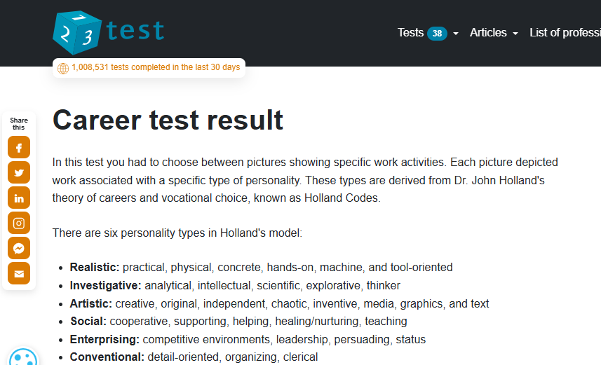

# Career Counselling

## Evidence

I attended a career counselling session and completed a career interest test.

## Reflection (STAR Technique)

**Situation:** I was unsure about which ICT career path to focus on.  
**Task:** Attend the career counselling session and gain guidance.  
**Action:** I filled out a questionnaire and discussed my results with the career coach.  
**Result:** I gained clarity on pursuing front-end development and UI/UX design.

