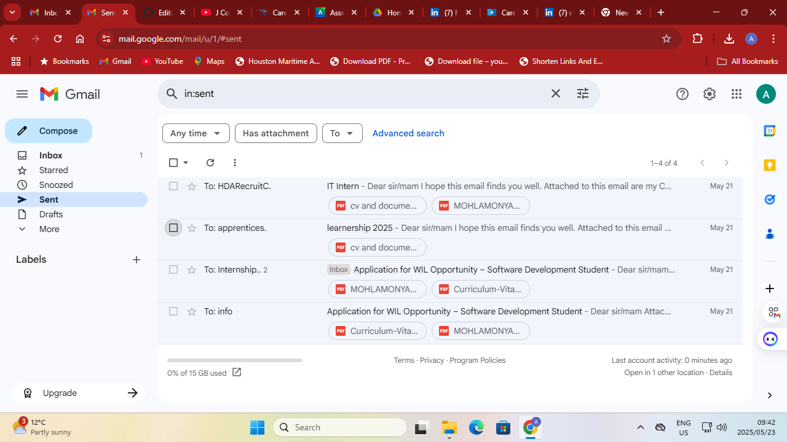

# My Curriculum Vitae

## 📄 Evidence

[Download My CV (PDF)](./cv.pdf)

## 💬 Reflection (STAR Technique)

**Situation:** I needed to create a professional CV to apply for internship or WIL opportunities.  
**Task:** Build a CV that clearly outlines my skills, education, and achievements.  
**Action:** I used a modern CV template and tailored the content to highlight relevant experience like Java GUI projects and Laravel web apps.  
**Result:** I now have a professional, tailored CV which has already been submitted to a few local ICT companies for internship opportunities.

---

## ✅ CV Submission Proof

I submitted my CV to several companies.

